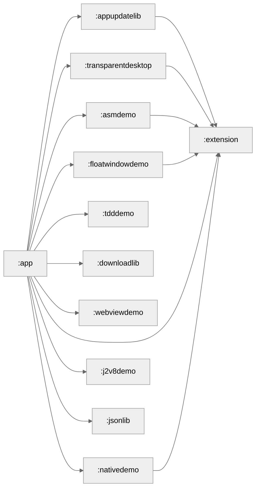

# LeonApplication

Leon's sample application about some project sample.

# Sample list

## [Asm demo](/asmdemo)

Include some demo about ASM bytecode transformer with Android Gradle Plugin.

And the plugin's implementation is located in [asmdemo-build-logic](/asmdemo-build-logic)

## [Float Window demo](/floatwindowdemo)

A sample shows that how to implement a whole screen float window, and handle it touch events.

## [WebView demo](/webviewdemo)

A sample shows that how Android works with WebView, with a few tests about WebView's performance.

## [TDD demo](/tdddemo)

A sample shows that how to using Test Driven Development in Android project.

# Build

Each sample implement as a module, with a *MainActivity* entry include UI.
Every module with a *MainActivity* should expose a launcher icon with `activity-alias` in module
level `AndroidManifest.xml`.

```xml

<manifest xmlns:android="http://schemas.android.com/apk/res/android">

  <application>
    <activity android:name=".AsmDemoActivity" android:taskAffinity="com.example.leonapplication.asmdemo.demo"
      android:theme="@style/Theme.AppCompat.DayNight.NoActionBar" />

    <activity-alias android:name="AsmDemoActivity" android:exported="true" android:label="AsmDemoActivity"
      android:targetActivity=".AsmDemoActivity">

      <intent-filter>
        <action android:name="android.intent.action.MAIN" />
        <category android:name="android.intent.category.LAUNCHER" />
      </intent-filter>
    </activity-alias>
  </application>
</manifest>
```

Include the module that you want in `settings.gradle.kts`, and the `:app` module will auto implement
it. With the following code:

```kotlin
// auto implement all subproject that already loaded
rootProject.childProjects.forEach {
  if (it.key == "app") return@forEach
  implementation(it.value)
  println("### app module apply ${it.value}")
}
```

# Module graph

